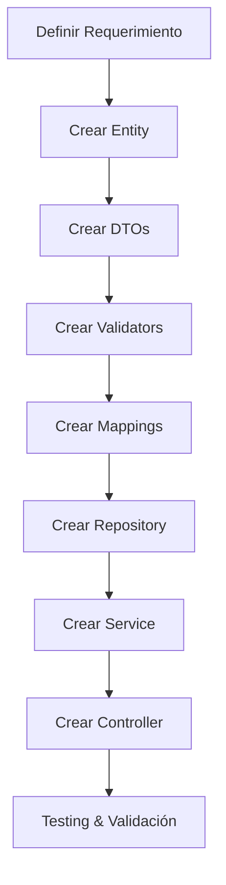
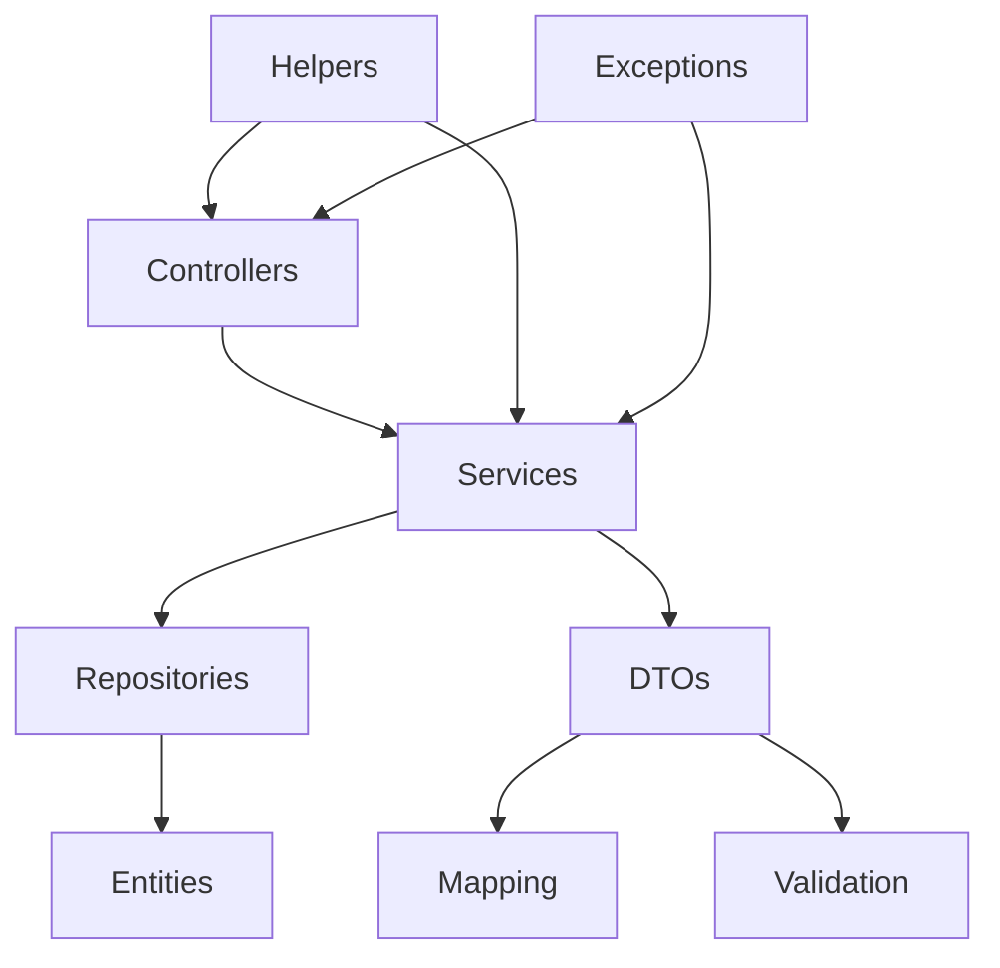
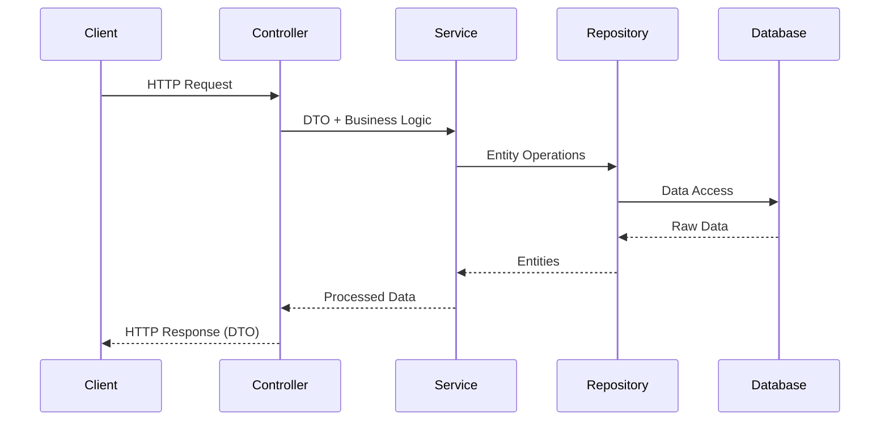

# API .NET Template

## Uso de la herramienta (Primero)

### Paso 0: Incluir playbook como submódulo

Para la construcción de una API .NET, primero debes incluir este repositorio como submódulo en la rama `main`:

```bash
git submodule add -b main https://github.com/bmslabs/bmlabs-ai-playbook-api-dotnet .github
```

Con esto tendrás disponible el prompt [0.-Genesis.prompt.md](.github/prompts/0.-Genesis.prompt.md).

### Prompt de arranque: Genesis

Después de agregar el submódulo, el primer paso recomendado es gatillar el prompt `0.-Genesis.prompt.md`, que inicializa un proyecto API .NET desde cero con estructura y archivos base.

#### Cómo gatillarlo

Ejemplo:

```bash
@copilot /Genesis projectName=bmlabs-playbook-backoffice-api
```

#### Resultado esperado

- Crea el proyecto API .NET en la raíz del workspace.
- Genera la estructura mínima para los demás prompts:
    - `controllers`
    - `core`
    - `core/dtos`
    - `core/entities`
    - `core/repositories`
    - `core/services`
    - `database`
    - `docs`
    - `helpers`
- Crea archivos base requeridos:
    - `.env.example`
    - `.dockerignore`
    - `.gitignore`
    - `DockerFile`
    - `README.MD` (inicial)
- Copia `.github/copilot-instructions.md` como `AGENTS.md` en la raíz.
- Deja `README.MD` con instrucciones iniciales de uso y disparo del flujo Genesis.

## Descripción

Este es un template para la construcción de APIs backend robustas, seguras y mantenibles usando ASP.NET Core. El proyecto está diseñado como una guía y base para futuros proyectos, implementando mejores prácticas de arquitectura, seguridad y observabilidad.

## Finalidad

- **Template base**: Punto de partida para nuevos proyectos de API en .NET
- **Guía de arquitectura**: Implementa patrones y principios consolidados
- **Rapidez de desarrollo**: Estructura preconfigurada que acelera el desarrollo
- **Mantenibilidad**: Código organizado y separación clara de responsabilidades
- **Escalabilidad**: Arquitectura preparada para crecer con el proyecto


## Desarrollo Asistido con GitHub Copilot

### Archivos de Configuración Copilot

Este template incluye configuración especializada para GitHub Copilot que acelera significativamente el desarrollo:

#### **AGENTS.md**
- **Ubicación**: `/AGENTS.md` (raíz del proyecto)
- **Propósito**: Define reglas globales y arquitectura del proyecto para Copilot
- **Contenido**: Principios, estructura de capas, responsabilidades y restricciones
- **Uso**: Copilot automáticamente lee estas reglas al generar código

#### **copilot-instructions.md** 
- **Ubicación**: `/.github/copilot-instructions.md`
- **Propósito**: Instrucciones técnicas específicas para generación de código
- **Contenido**: Estándares de API REST, patrones de implementación, convenciones de código
- **Enfoque**: Seguridad, mantenibilidad, observabilidad y contratos HTTP estables

#### **Skills Directory**
- **Ubicación**: `/.github/skills/`
- **Propósito**: Flujos de trabajo especializados para cada componente de la API
- **Invocación**: Skills invocables por el usuario con argumentos específicos

### Skills Disponibles

El template incluye **7 skills especializados** para desarrollo de APIs .NET:

| Skill | Descripción | Comando de Ejemplo |
|-------|-------------|-------------------|
| `be-create-controller` | Genera controllers siguiendo convenciones del proyecto | `@copilot /be-create-controller ProductoController` |
| `be-create-service` | Crea services con herencia de CrudService base | `@copilot /be-create-service ProductoService` |
| `be-create-dtos` | Genera DTOs completos con validación | `@copilot /be-create-dtos ProductoDto` |
| `be-create-entities` | Crea entidades EF Core con configuración | `@copilot /be-create-entities Producto` |
| `be-create-repository` | Implementa repositories con patrones estándar | `@copilot /be-create-repository ProductoRepository` |
| `be-create-mappings` | Configura AutoMapper profiles | `@copilot /be-create-mappings ProductoMapping` |
| `be-create-validators` | Implementa FluentValidation rules | `@copilot /be-create-validators ProductoValidator` |

### Flujo de Trabajo con Copilot

#### **Desarrollo Completo de Endpoint** (Recomendado)



#### **Comandos Secuenciales de Ejemplo:**

```bash
# 1. Crear entidad base
@copilot /be-create-entities Producto

# 2. Generar DTOs completos
@copilot /be-create-dtos ProductoDto

# 3. Implementar validadores
@copilot /be-create-validators ProductoValidator

# 4. Configurar mappings
@copilot /be-create-mappings ProductoMapping

# 5. Crear repository
@copilot /be-create-repository ProductoRepository

# 6. Implementar service
@copilot /be-create-service ProductoService

# 7. Crear controller final
@copilot /be-create-controller ProductoController
```

### Ventajas del Desarrollo Asistido

#### **Velocidad de Desarrollo**
- **Generación instantánea**: Componentes completos en segundos
- **Código consistente**: Sigue automáticamente las convenciones del proyecto
- **Menos repetición**: Skills reutilizables para patrones comunes

#### **Calidad Garantizada**
- **Mejores prácticas**: Implementa automáticamente principios SOLID
- **Seguridad por defecto**: Sin hardcodeo de secrets, validación robusta
- **Documentación automática**: XML docs y swagger incluidos

#### **Mantenibilidad**
- **Arquitectura coherente**: Todos los componentes siguen la misma estructura
- **Estilo consistente**: Naming conventions y patrones unificados
- **Debugging facilitado**: Logging y manejo de errores estandardizado

### Comandos Útiles de Copilot

```bash
# Generar endpoint completo para una entidad
@copilot Crea un CRUD completo para la entidad Cliente

# Aplicar validaciones específicas
@copilot Agrega validación de email y teléfono al DTO Usuario

# Implementar búsqueda avanzada 
@copilot Crea endpoint de búsqueda con filtros para Producto

# Optimizar consultas
@copilot Optimiza el repository para consultas de solo lectura

# Agregar logging
@copilot Agrega logging estructurado al service de Pedidos
```

### Tips para Máximo Rendimiento

1. **Usa nombres descriptivos**: Los skills generan mejor código con nombres específicos
2. **Menciona relaciones**: "ProductoDto con relación a CategoriaDto"  
3. **Especifica validaciones**: "Email obligatorio, teléfono opcional"
4. **Indica tipos especiales**: "Guid para IDs, DateTimeOffset para fechas"
5. **Menciona patrones**: "Repository con soft delete" o "Service con caching"


## Tecnologías

### Core Technologies
- **.NET 8+** / **ASP.NET Core 10+**
- **Entity Framework Core** - ORM agnóstico a base de datos
- **AutoMapper** - Mapeo de objetos (DTOs ↔ Entities)
- **FluentValidation** - Validación de DTOs y reglas de negocio

### Infraestructura y Herramientas
- **Swagger/OpenAPI** - Documentación automática de API
- **Dependency Injection** - Container IoC nativo de ASP.NET Core
- **Logging** - ILogger integrado para observabilidad
- **Configuration** - Sistema de configuración por entornos
- **Middleware Pipeline** - Manejo centralizado de requests/responses

### Patrones de Desarrollo
- **Repository Pattern** - Abstracción del acceso a datos
- **Service Layer Pattern** - Lógica de negocio encapsulada
- **DTO Pattern** - Contratos de API desacoplados de entidades
- **Validation Pattern** - Validación centralizada y reutilizable

## Arquitectura

### Arquitectura por Capas

El proyecto implementa una **arquitectura por capas** con separación clara de responsabilidades:



### Flujo de Datos



## Estructura del Proyecto

### Organización de Carpetas

```
api-dotnet/
├── controllers/              # Endpoints HTTP y contratos de API
├── core/
│   ├── dto/                 # Data Transfer Objects
│   │   ├── mapping/         # Configuración AutoMapper
│   │   └── validator/       # Validadores FluentValidation
│   ├── entities/            # Entidades de dominio/EF Core
│   ├── exceptions/          # Excepciones personalizadas
│   ├── repositories/        # Abstracciones de acceso a datos
│   └── services/           # Lógica de negocio y aplicación
├── documentation/          # Documentación técnica
└── helpers/               # Utilidades y extensiones compartidas
```

### Responsabilidades por Capa

#### **Controllers**
- Endpoints HTTP (GET, POST, PUT, DELETE)
- Binding y validación de requests
- Códigos de estado HTTP
- Metadata para OpenAPI/Swagger
- Autorización y autenticación
- **NO contiene lógica de negocio**

#### **Services** 
- Lógica de aplicación y negocio
- Orquestación de casos de uso
- Coordinación entre repositories
- Aplicación de reglas de dominio
- Transformación de datos

#### **Repositories**
- Abstracción del acceso a datos
- Operaciones CRUD sobre entidades
- Consultas específicas del dominio
- Implementación agnóstica a BD

#### **DTOs (Data Transfer Objects)**
- Contratos de entrada/salida de API
- Modelos específicos para requests/responses
- **NO son entidades de base de datos**
- Desacoplamiento cliente-servidor

#### **Entities**
- Modelos de dominio
- Entidades de Entity Framework
- Representación de datos persistentes
- Relaciones y constraints

#### **Helpers**
- Utilidades compartidas y reutilizables
- Extensiones de tipos base
- Funciones transversales
- **Sin lógica de dominio específica**

#### **Exceptions**
- Excepciones personalizadas del dominio
- Manejo específico de errores de negocio
- Mensajes descriptivos para debugging

## Principios de Desarrollo

### Principios Arquitectónicos
- **Separación de Responsabilidades**: Cada capa tiene un propósito específico
- **Inversión de Dependencias**: Depender de abstracciones, no de implementaciones
- **Single Responsibility**: Una clase, una razón para cambiar
- **Open/Closed**: Abierto para extensión, cerrado para modificación

### Mejores Prácticas
- **Controllers delgados**: Sin lógica de negocio
- **Uso de DTOs**: No exposición directa de entidades
- **Validación centralizada**: FluentValidation para reglas de negocio
- **Manejo explícito de errores**: Excepciones tipadas y descriptivas
- **Código legible**: Nombres descriptivos y estructura clara
- **Configuración externa**: No hardcodear valores críticos

### Restricciones de Diseño
- ❌ **No lógica de negocio en Controllers**
- ❌ **No acceso directo a persistencia desde Controllers** 
- ❌ **No exposición de Entities como contratos de API**
- ❌ **No hardcodeo de secrets, URLs o connection strings**
- ❌ **No abstracciones "mágicas" innecesarias**

## Guía de Uso

### 1. **Crear un nuevo endpoint**
1. Define el DTO en `core/dto/`
2. Crea el validador en `core/dto/validator/`
3. Implementa el mapping en `core/dto/mapping/`
4. Desarrolla la lógica en `core/services/`
5. Crea el controller en `controllers/`

### 2. **Agregar nueva entidad**
1. Define la entidad en `core/entities/`
2. Crea el repository en `core/repositories/`
3. Implementa el service correspondiente
4. Configura los DTOs y mappings

### 3. **Manejo de errores**
1. Define excepciones específicas en `core/exceptions/`
2. Implementa manejo en services
3. Configura respuestas HTTP apropiadas en controllers

## Recursos Adicionales

- [Documentación ASP.NET Core](https://docs.microsoft.com/aspnet/core)
- [Entity Framework Core](https://docs.microsoft.com/ef/core)
- [AutoMapper](https://automapper.org)
- [FluentValidation](https://fluentvalidation.net)
- [GitHub Copilot Documentation](https://docs.github.com/copilot)
- [Clean Architecture Principles](https://blog.cleancoder.com/uncle-bob/2012/08/13/the-clean-architecture.html)

---

**Nota**: Este template está diseñado para ser adaptado según las necesidades específicas de cada proyecto. Los principios y estructura base deben mantenerse, pero las implementaciones específicas pueden variar según los requisitos del dominio.

**Copilot Tip**: Para obtener los mejores resultados, siempre menciona el contexto del negocio y las relaciones entre entidades al usar los skills.