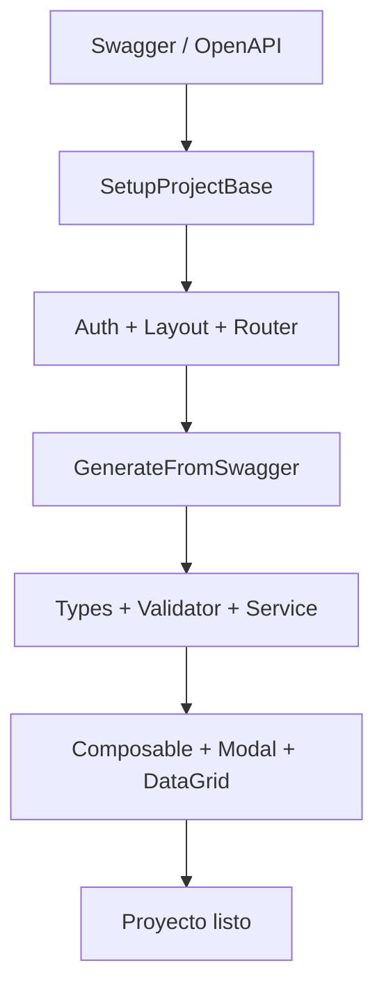
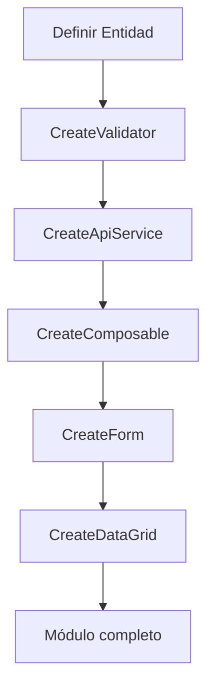

# Desarrollo Asistido con GitHub Copilot

### Archivos de Configuración Copilot

Este template incluye configuración especializada para GitHub Copilot que acelera el desarrollo:

#### **copilot-instructions.md**
- **Ubicación**: `/.github/copilot-instructions.md`
- **Propósito**: Instrucciones técnicas para generación de código (type-safety, patrones, prohibiciones)
- **Contenido**: Estándares Vue 3, TypeScript estricto, naming, dark mode, prohibición de `any`

#### **Skills Directory**
- **Ubicación**: `/.github/skills/`
- **Propósito**: Patrones y referencias reales por dominio, leídas automáticamente por agentes y prompts

### Agentes Disponibles

| Agente | Descripción | Ejemplo de uso |
|--------|-------------|---------------|
| `BM Builder` | Orquesta generación full-stack Vue 3 end-to-end | `@agent BM Builder CRUD de Invoices desde swagger.json` |
| `Explore` | Exploración rápida del codebase | `@agent Explore dónde se maneja la autenticación (quick)` |

### Prompts Disponibles

El template incluye **16 prompts** organizados por flujo de trabajo:

| Prompt | Descripción | Argumento |
|--------|-------------|-----------|
| `M.-SetupProjectBase` | Bootstrap inicial completo del proyecto (Auth, Layout, Router) | Ruta a swagger + URL base del backend |
| `A.-CreateComponent` | Componente Vue 3 tipado con componentes compartidos reales | Nombre y features del componente |
| `B.-CreateApiService` | Servicio API como clase estática tipada | Nombre de entidad y campos del backend |
| `C.-CreateDataGrid` | Vista CRUD completa con patrón 12/3 | Nombre de entidad y campos |
| `D.-CreateComposable` | Composable reactivo para lógica de negocio | Nombre del composable y entidad |
| `E.-CreateLayout` | DefaultLayout con Sidebar estándar y responsive | Tipo de layout (Dashboard, Auth) |
| `F.-CreateView` | Vista read-only, dashboard o detalle | Nombre de la vista y objetivo |
| `G.-CreateValidator` | Schema Zod reutilizable con mensajes en español | Entidad o campos a validar |
| `H.-CreateForm` | Modal de formulario con BaseModal + validación Zod | Spec OpenAPI o lista de campos |
| `I.-CreateAuthStore` | Store Pinia de autenticación con cookies HttpOnly | Campos de perfil del usuario |
| `J.-CreateAuthViews` | Vistas Login/Signup con Zod y Google Login opcional | Tipo de login (email, username, Google) |
| `K.-CreateProtectedRoutes` | Vue Router con auth guards y permisos | Lista de rutas y permisos |
| `L.-GenerateFullStackWorkflow` | Orquesta 6 prompts en orden (Types → Validator → Service → Composable → Modal → DataGrid) | Entidad a generar |
| `N.-CreateExportAction` | Exportación a Excel o PDF | Entidad y formato (Excel/PDF) |
| `O.-ChangeProjectColors` | Actualizar tema de colores de forma consistente | primaryColor, primaryDark y branding |
| `Z.-GenerateFromSwagger` | Stack completo desde Swagger/OpenAPI en una sola invocación | Endpoint o entidad desde swagger |

### Flujo de Trabajo con Copilot

#### **Proyecto Nuevo desde Swagger** (Recomendado)



#### **Nuevo Módulo CRUD** (Flujo estándar)



#### **Comandos de Ejemplo:**

```bash
# Bootstrap completo del proyecto
@prompt M.-SetupProjectBase swagger_local.json https://api.miapp.com

# Generar módulo completo desde Swagger
@prompt Z.-GenerateFromSwagger /invoices

# Generar módulo CRUD manual
@prompt G.-CreateValidator Invoice
@prompt B.-CreateApiService InvoiceService
@prompt D.-CreateComposable useInvoice
@prompt H.-CreateForm InvoiceForm
@prompt C.-CreateDataGrid InvoiceDataGrid

# Configurar autenticación
@prompt I.-CreateAuthStore user,role,permissions
@prompt J.-CreateAuthViews email,Google
@prompt K.-CreateProtectedRoutes admin,user
```

### Skills de Referencia

| Skill | Propósito |
|-------|-----------|
| `vue-master-crud-standard` | Patrón CRUD 12/3: estructura y bloques del script setup |
| `vue-create-api-service` | Clase estática con `httpClient` tipado, sin Axios directo |
| `vue-form-input-patterns` | Mapeo tipo de dato → componente de input correcto |
| `vue-standard-components-ref` | Catálogo de componentes compartidos de producción |
| `vue-component-taxonomy` | Clasificación de componentes por tipo y responsabilidad |
| `vue-create-composables` | Composables reactivos con separación de estado/lógica |
| `vue-create-datagrid` | DataTable avanzada con filtros y paginación |
| `vue-create-protected-routes` | Guardias de navegación con `checkAuthIfNeeded` |
| `vue-openapi-direct-codegen` | Generación directa de tipos y servicios desde OpenAPI |
| `vue-export-patterns` | Exportación a Excel/PDF/CSV desde vistas |
| `vue-use-unified-modal` | Patrón de modal unificado con BaseModal |

### Ventajas del Desarrollo Asistido

#### **Velocidad**
- Módulos completos generados en segundos desde un swagger
- Flujos orquestados (prompt `L` y `Z`) eliminan pasos manuales repetitivos

#### **Calidad Garantizada**
- TypeScript estricto: 0 `any` tolerado
- Dark mode incluido por defecto en todos los componentes
- Validación Zod obligatoria en formularios

#### **Consistencia**
- Patrón CRUD 12/3 estandarizado en todas las vistas
- Naming en inglés para identificadores, controlado por skills
- `httpClient` centralizado: nunca Axios directo

---

## Documentación

- **Prompts y Skills**: Ver [`.github/README.md`](./.github/README.md)
- **Estándares de código**: Ver [`GOVERNANCE.md`](./GOVERNANCE.md)
- **Patrones de naming**: Ver [`NAMING_PATTERNS.md`](./NAMING_PATTERNS.md)
